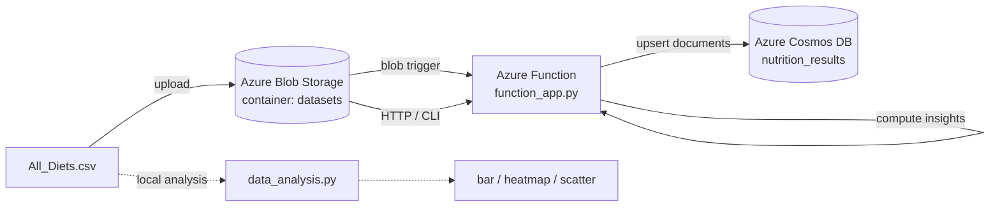

# Diet Analytics - Backend

Cloud-native backend that reads a recipe nutrition dataset from **Azure Blob
Storage**, computes macronutrient insights in an **Azure Function**, and stores
the results in **Azure Cosmos DB**. Also includes a local pandas analysis with
charts.

This is the Backend / Data Analyst slice of a three-person project. It covers
**Task 1** (data analysis and visualizations) and **Task 3** (serverless data
processing), and provides the **Task 2** Dockerfile for the analysis app.

---

## Architecture



The dataset lands in Blob Storage, which fires the Function automatically. The
Function computes average protein, carbs, and fat per diet type and writes one
document per diet into Cosmos DB. The same compute logic also runs from the CLI
and inside the local analysis script, so every path produces identical numbers.

---

## Repository structure

```
data_analysis.py            Task 1: insights + bar/heatmap/scatter charts (local pandas)
lambda_function.py          CLI: --upload (seed Blob), --run (process -> Cosmos)
setup_azure.sh              one-shot provisioning of all Azure resources
azure_function/
  function_app.py           Task 3: Blob trigger + HTTP trigger (Python v2 model)
  insights.py               shared compute + Cosmos write (single source of truth)
  host.json                 Functions host config
  requirements.txt          Function dependencies
  local.settings.json       local app settings (generated by setup; gitignored)
Dockerfile                  Task 2: container for data_analysis.py
requirements.txt            dependencies for Task 1 + the CLI
HANDOFF.md                  deploy instructions for a teammate
All_Diets.csv               dataset (synthetic sample; replace with real Kaggle file)
make_sample.py              regenerates the synthetic sample
```

---

## Prerequisites

- Python 3.11 and `pip`
- Azure CLI (`az login`) with an active subscription (Azure for Students works)
- Azure Functions Core Tools v4 (`func`), only needed to deploy the Function App

---

## Quick start

### 1. Provision Azure resources

```bash
az login
bash setup_azure.sh
```

This creates a resource group, storage account, `datasets` blob container,
Cosmos DB database and container, then writes the connection strings into
`setenv.sh` and `azure_function/local.settings.json` automatically. No secrets
to copy by hand.

### 2. Process the data (no deploy needed)

```bash
pip install -r requirements.txt
source setenv.sh
python3 lambda_function.py --upload   # put All_Diets.csv into Blob Storage
python3 lambda_function.py --run       # read it, compute, write to Cosmos DB
```

Open the Cosmos DB Data Explorer in the portal to see the `nutrition_results`
documents (one per diet type).

### 3. Deploy the real Function App (optional, full Task 3)

```bash
bash setup_azure.sh --deploy
```

After this, uploading the CSV to the `datasets` container fires the Function
automatically. Watch it under the function's Monitor tab in the portal. The HTTP
trigger is also available at `https://<app>.azurewebsites.net/api/process?code=<key>`.

---

## Task mapping

| File | Task | Description |
|---|---|---|
| `data_analysis.py` | Task 1 | averages, top-5 protein per diet, ratios, charts |
| `azure_function/` | Task 3 | deployed Function: Blob trigger + HTTP trigger |
| `lambda_function.py` | Task 3 | CLI to seed Blob and run on demand |
| `Dockerfile` | Task 2 | containerizes the analysis app |

---

## Task 1: analysis and charts (local, no Azure)

```bash
python3 data_analysis.py
```

Produces in `./output/`:

- `01_avg_macros_bar.png` - average protein/carbs/fat per diet type
- `02_macros_heatmap.png` - macronutrients vs diet types
- `03_top_protein_scatter.png` - top 5 protein recipes across cuisines
- `all_diets_enriched.csv` - dataset with protein-to-carbs and carbs-to-fat ratios
- `avg_macros_by_diet.csv` - summary table

Every insight prints with a timestamp, which is useful for the dated screenshots
the rubric asks for.

---

## Task 2: Docker

```bash
docker build -t diet-analysis .
docker run --rm -v "$PWD/output:/app/output" diet-analysis
```

---

## Cosmos DB document shape

Container `nutrition_results`, partition key `/diet_type`, one item per diet type:

```json
{
  "id": "keto",
  "diet_type": "keto",
  "avg_protein_g": 91.6,
  "avg_carbs_g": 19.95,
  "avg_fat_g": 108.45,
  "recipe_count": 191,
  "is_highest_protein": true,
  "generated_at": "2026-06-11T05:59:46+00:00",
  "source": "blob://datasets/All_Diets.csv"
}
```

Re-runs upsert on `id`, so the collection always reflects the latest run rather
than accumulating duplicates.

---

## Team scope

| Area | Owner |
|---|---|
| Data analysis + serverless function (this repo) | me (backend) |
| Azure resource provisioning, dataset/results storage | Person 1 |
| CI/CD pipeline (GitHub Actions) | Person 3 |

---

## Configuration

Environment variables read at runtime (set by `setup_azure.sh`):

| Variable | Used by | Default |
|---|---|---|
| `AZURE_STORAGE_CONNECTION_STRING` | CLI | required |
| `DATA_STORAGE` | Function App | required |
| `COSMOS_CONNECTION_STRING` | both | required |
| `CONTAINER` | both | `datasets` |
| `BLOB_NAME` | both | `All_Diets.csv` |
| `COSMOS_DATABASE` | both | `diet_analytics` |
| `COSMOS_CONTAINER` | both | `nutrition_results` |

---

## Security

`setenv.sh` and `azure_function/local.settings.json` hold live connection
strings and are excluded by `.gitignore`. Do not commit them. If a key is ever
exposed, regenerate it in the portal.

---

## Cost and teardown

Runs comfortably within Azure for Students credit. Delete everything when done:

```bash
az group delete -n diet-rg --yes --no-wait
```

---

## Notes

- `All_Diets.csv` in this repo is synthetic test data from `make_sample.py`.
  Replace it with the real Kaggle dataset before recording final results.
- Column headers are normalized, so `Protein(g)` and `Protein (g)` both work.
- Missing macro values are filled with the per-diet-type mean.
